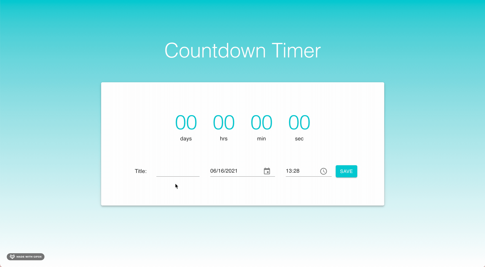

# Countdown Timer

[countdown-timer.paulina.tech](https://countdown-timer.paulina.tech)

This app allows a user to create a due date and visualize the remaining time in a countdown timer. The project was created with Create React App and a minimal setup custom template. [Material-UI](https://material-ui.com/) has also been used in order to minimize CSS coding and to simplify responsive layout.

